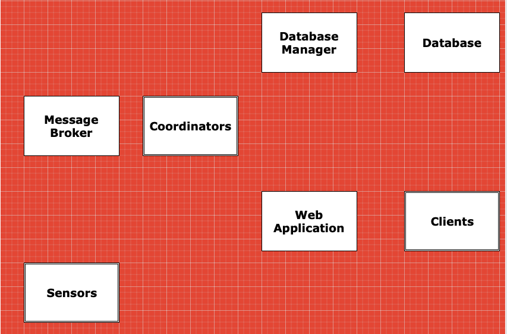

## POWER PLANT MONITORING SIMULATOR DISTRIBUTED APPLICATION

This application simulates a monitoring system for a power plant.  
This type of monitoring is critical since the steam in a modern power plant is often at extremely high temperatures and  
pressures in order to achieve the highest possible efficiency. The monitoring system ensures that everything is operating withing a range that balances efficiency and safety.

## Main Requirements
1. Record Measurements
2. Store Readings
3. Monitoring system

## Tools and Libraries
1. Go
2. RabbitMQ as message broker
3. Postgresql as data store

## Install Tools
1. Go  
[Install Golang](https://golang.org/doc/install)  

2. RabbitMQ
    * [Install Erlang](https://www.erlang.org/downloads)
    * [Install RabbitMQ](https://www.rabbitmq.com/download.html)

## Application Architecture

## Start Systems
1. Export rabbitmq connection string in your terminal  
`export CONNSTRING=amqp://<user>:<password>@localhost:5672`

2. Run Coordinators  
`make run_coordinators`

3. Run Sensors  
`make run_sensors`

